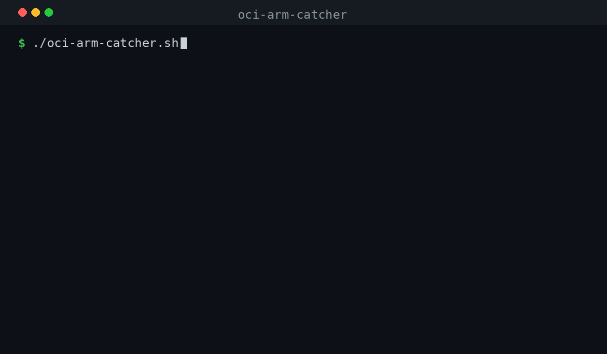

# oci-arm-catcher

**Grab Oracle Cloud's free ARM capacity the moment it appears.** A tiny,
dependency-light poller that retries `oci compute instance launch` for the
Always Free `VM.Standard.A1.Flex` shape until Oracle finally has capacity —
then launches your instance and pings you.



If you've ever tried to create a free Ampere A1 instance and hit this,
repeatedly, for days:

```
ServiceError:
  code: InternalError
  message: Out of host capacity.
```

…this is for you. Start it, walk away, get a notification when your instance is
up.

> Works on **macOS, Linux, and Windows**. Bash script for macOS/Linux, a native
> PowerShell port for Windows.

---

## Why this exists

Oracle's [Always Free tier](https://docs.oracle.com/en-us/iaas/Content/FreeTier/freetier_topic-Always_Free_Resources.htm)
gives every account **2 ARM OCPUs and 12 GB of RAM** on the Ampere A1 platform —
genuinely free, forever, no trial clock. Still one of the best free compute deals
anywhere: enough for a self-hosted app stack, a game server, or a personal VPN.

> **Note (June 2026):** Oracle quietly halved the Always Free Ampere allowance
> from 4 OCPU / 24 GB to **2 OCPU / 12 GB** (1,500 OCPU-hours + 9,000 GB-hours per
> month) on 15 June 2026, with no announcement. Pay-as-you-go accounts have
> reportedly kept the old 4 OCPU / 24 GB at no charge, but Oracle hasn't confirmed
> that publicly — check your own billing before assuming. Set `OCPUS` /
> `MEMORY_GB` in your `.env` to whatever your account actually allows.

The catch: those ARM hosts are in heavy demand, so launching an instance very
often fails with **"Out of host capacity"**. US regions can be dry for hours or
days; even busy EU/APAC regions dip in and out. Capacity frees up
unpredictably, in small windows, and whoever's polling at that second wins.

`oci-arm-catcher` is that poller. It hammers the launch API on a polite interval,
recognises the "no capacity, try again" family of errors, and grabs the slot the
instant one opens — including rotating across multiple Availability Domains if
your region has them.

It's a single script with no runtime dependencies beyond the official OCI CLI and
Python 3 (which ships with macOS and virtually every Linux). It's been used in
production to catch a 4 OCPU / 24 GB A1 instance on a real account (under the
pre-June-2026 limits).

## Who it's for

Anyone trying to provision an Always Free (or paid) `A1.Flex` ARM instance who
keeps hitting capacity errors — homelabbers, self-hosters, indie devs, students,
and devops folks who want a free always-on ARM box.

---

## How it works

```
loop:
  oci compute instance launch  --shape VM.Standard.A1.Flex ...
  ├─ success            → parse instance OCID, desktop notification, exit 0
  ├─ "out of capacity"  → wait RETRY_INTERVAL, rotate AD, retry
  │   InternalError / LimitExceeded / TooManyRequests / timeout
  └─ any other error    → print it, notify, stop (so you can fix config)
```

The error handling is the important part: it only retries on the errors that
mean *"come back later"*, and stops immediately on real problems (bad OCID,
auth failure, quota exceeded) instead of looping forever against a wall.

---

## Prerequisites

1. **An Oracle Cloud account** (Always Free is fine) and a region picked.
2. **A VCN with a public subnet** in that region. The OCI console's "Create
   VCN with Internet Connectivity" wizard sets this up in one click.
3. **The OCI CLI**, installed and configured:

   ```bash
   # macOS
   brew install oci-cli
   # Linux / Windows / anything with pip
   pip install oci-cli

   # one-time auth setup — creates ~/.oci/config
   oci setup config
   ```

   Verify it works:

   ```bash
   oci iam region list
   ```

4. **Python 3** — used to parse JSON responses. Already present on macOS and
   most Linux distros (`python3 --version`).

---

## Quick start

```bash
git clone https://github.com/alexpua/oci-arm-catcher.git
cd oci-arm-catcher

cp .env.example .env       # then edit .env (see below)
chmod +x oci-arm-catcher.sh
./oci-arm-catcher.sh
```

On Windows (PowerShell):

```powershell
git clone https://github.com/alexpua/oci-arm-catcher.git
cd oci-arm-catcher

Copy-Item .env.example .env   # then edit .env
.\oci-arm-catcher.ps1
```

---

## Configuration

All settings live in `.env` (copied from `.env.example`). The fiddly part is
finding your OCIDs — there's a helper for that.

### Auto-discover your OCIDs

After `oci setup config` works, run the discovery helper. It's **read-only** —
it launches nothing, just prints the values you need:

```bash
./scripts/get-config.sh
# or on Windows:
.\scripts\get-config.ps1
```

It prints your compartment OCIDs, availability domains, subnets, and the latest
ARM image ID, formatted so you can paste them straight into `.env`.

### Finding values manually

| Variable | What it is | Command |
|---|---|---|
| `COMPARTMENT_ID` | Where the instance is created (tenancy root works) | `oci iam compartment list --all` |
| `AVAILABILITY_DOMAIN` | The AD to launch in | `oci iam availability-domain list` |
| `SUBNET_ID` | A public subnet in your VCN | `oci network subnet list --compartment-id <id> --all` |
| `IMAGE_ID` | An **aarch64/ARM** OS image | `oci compute image list --compartment-id <id> --operating-system "Canonical Ubuntu" --shape VM.Standard.A1.Flex --all` |
| `SSH_KEY_FILE` | Path to your SSH **public** key (`.pub`) | `ls ~/.ssh/*.pub` |

### All settings

| Variable | Required | Default | Notes |
|---|---|---|---|
| `COMPARTMENT_ID` | yes | — | Compartment / tenancy OCID |
| `DISPLAY_NAME` | yes | — | Instance name in the console |
| `SSH_KEY_FILE` | yes | — | Path to your `.pub` key |
| `AVAILABILITY_DOMAIN` | yes\* | — | Single AD |
| `AVAILABILITY_DOMAINS` | yes\* | — | Comma-separated ADs to **rotate** across; overrides the single one |
| `SUBNET_ID` | yes | — | Public subnet OCID |
| `IMAGE_ID` | yes | — | ARM image OCID |
| `OCPUS` | yes | `2` | Always Free max is 2 total (was 4 before 15 Jun 2026) |
| `MEMORY_GB` | yes | `12` | Always Free max is 12 total (was 24 before 15 Jun 2026) |
| `RETRY_INTERVAL` | no | `300` | Seconds between attempts |

\* Set **either** `AVAILABILITY_DOMAIN` (one AD) **or** `AVAILABILITY_DOMAINS`
(rotation). If both are set, the rotating list wins.

### Multi-AD rotation

Regions like Ashburn, Phoenix, and Frankfurt have three Availability Domains,
and capacity can appear in any one of them. Set them all and the catcher cycles
through on each retry, multiplying your chances:

```bash
AVAILABILITY_DOMAINS="Abcd:US-ASHBURN-1-AD-1,Abcd:US-ASHBURN-1-AD-2,Abcd:US-ASHBURN-1-AD-3"
```

(Most single-AD regions just use `AVAILABILITY_DOMAIN`.)

---

## Running it in the background

You'll likely want this running for hours. Pick one:

**nohup** — fire and forget, logs to a file:

```bash
nohup ./oci-arm-catcher.sh > catcher.log 2>&1 &
tail -f catcher.log          # watch progress
```

**tmux / screen** — detachable session you can reattach to:

```bash
tmux new -s catcher
./oci-arm-catcher.sh
# detach: Ctrl-b then d   ·   reattach: tmux attach -t catcher
```

**Windows** — run in a PowerShell window, or as a background job:

```powershell
Start-Job -ScriptBlock { & "C:\path\to\oci-arm-catcher.ps1" }
```

The script prints a once-a-minute heartbeat when it detects it's writing to a
log file (non-interactive), and a live countdown when run in a terminal.

---

## Running on Windows

Two options:

1. **Native PowerShell** (recommended) — use `oci-arm-catcher.ps1` as shown
   above. It shows Windows toast notifications (via
   [BurntToast](https://github.com/Windos/BurntToast) if installed, otherwise a
   tray balloon).
2. **WSL2 or Git Bash** — if you'd rather use the bash version, run it inside
   [WSL2](https://learn.microsoft.com/windows/wsl/install) or Git Bash exactly
   as on Linux. You'll need `python3` available in that environment.

---

## Troubleshooting

**`'oci' is not installed or not on PATH`**
The OCI CLI isn't installed or your shell can't find it. Re-run the install
step, then `oci iam region list` to confirm. On macOS with Homebrew you may need
to restart your terminal.

**It keeps printing `InternalError: Out of host capacity.`**
That's expected — it's working. Capacity genuinely isn't available yet. Leave it
running. Consider adding more Availability Domains, or try a different region's
account if you have one.

**`NotAuthorizedOrNotFound` and it stops immediately**
This is *not* a capacity error, so the catcher stops on purpose. Usually a wrong
or mismatched OCID — double-check that `COMPARTMENT_ID`, `SUBNET_ID`, and
`IMAGE_ID` all belong to the **same region** as your AD.

**`LimitExceeded`**
You've hit your Always Free allowance — **2 OCPU / 12 GB total** since 15 June
2026 (it was 4 OCPU / 24 GB before). Delete or shrink existing A1 instances, or
lower `OCPUS`/`MEMORY_GB`. This is not a capacity error, so the catcher stops
instead of retrying.

**It looks frozen — the spinner just keeps spinning**
Older versions could appear to hang here. The OCI CLI's Python SDK has its own
internal retry/backoff, independent of `--connection-timeout` / `--read-timeout`:
after a `500` it can silently loop on `429 Too Many Requests` for minutes inside a
single attempt, so `RETRY_INTERVAL` no longer reflects the real interval. The
catcher now passes `--no-retry` and does its own retrying, which fixes this
(thanks [@zearp](https://github.com/zearp), [#1](https://github.com/alexpua/oci-arm-catcher/issues/1)).
If you're on an older copy, `git pull`.

**The image won't boot / wrong architecture**
Make sure `IMAGE_ID` is an **aarch64 / ARM** image. x86 images won't launch on
`A1.Flex`. The `get-config` helper filters to ARM images for you.

**Notifications don't show up**
They're best-effort. On Linux install `libnotify` (`notify-send`); on Windows
`Install-Module BurntToast` for nicer toasts. The script always prints to the
console regardless.

---

## Development & tests

The bash script is covered by [bats](https://github.com/bats-core/bats-core)
tests that mock the `oci` CLI, and the PowerShell port by
[Pester](https://pester.dev/). Both run in CI (plus
[ShellCheck](https://www.shellcheck.net/)).

Install the dev tools:

```bash
# macOS (Homebrew)
brew install bats-core shellcheck

# Debian / Ubuntu
sudo apt-get install -y bats shellcheck

# Pester (PowerShell, any OS) — usually preinstalled on Windows
pwsh -c "Install-Module Pester -Scope CurrentUser -Force"
```

Run them:

```bash
# bash
bats tests/

# powershell
Invoke-Pester -Path tests/oci-arm-catcher.Tests.ps1

# lint
shellcheck oci-arm-catcher.sh scripts/get-config.sh
```

For testability the bash script can be sourced in "library mode"
(`OCI_ARM_CATCHER_LIB=1 source ./oci-arm-catcher.sh`), which defines its helper
functions without running the main loop.

---

## Disclaimer

This tool only calls the official OCI CLI on your behalf, on a polite retry
interval — it doesn't bypass any limits or do anything Oracle's own console
doesn't. You're responsible for staying within your account's terms and free-tier
limits. Provided as-is under the MIT License.

## Contributing

Issues and PRs welcome — especially: more OS/notification backends, smarter
backoff, and region/AD presets.

## Support

If `oci-arm-catcher` caught you a free server, two things help a lot:

- ⭐ **[Star the repo](https://github.com/alexpua/oci-arm-catcher)** — it's how other people fighting "Out of host capacity" find it.
- ☕ **[Buy me a coffee](https://send.monobank.ua/jar/4Hq7auheaa)** — if it saved you some time and you feel like it.

Both are completely optional. The tool is free and always will be.

## License

[MIT](LICENSE)
